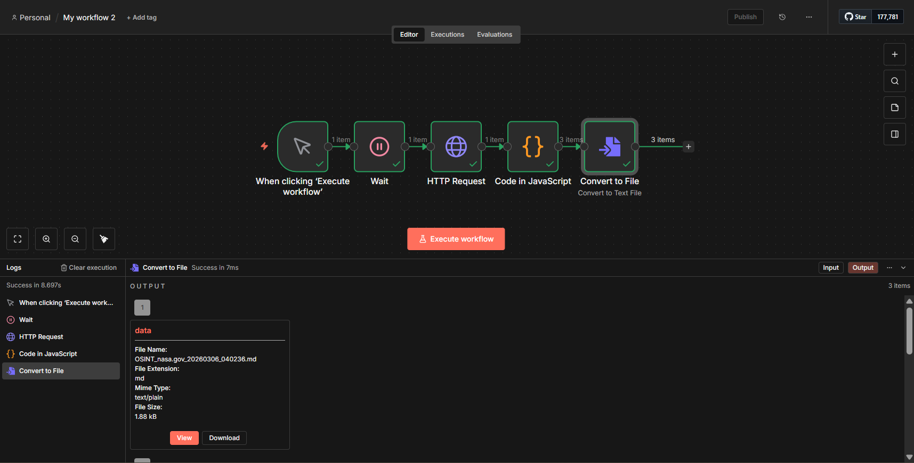
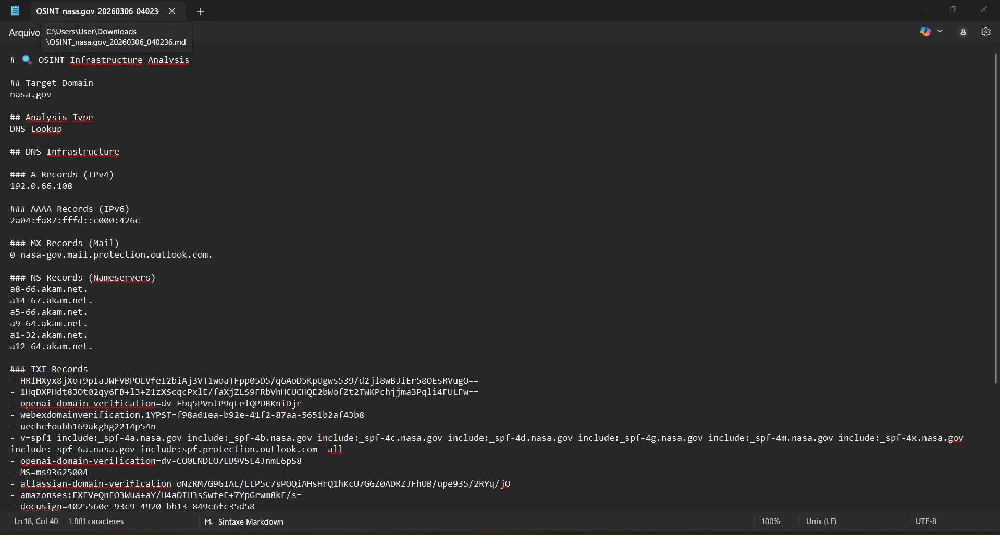
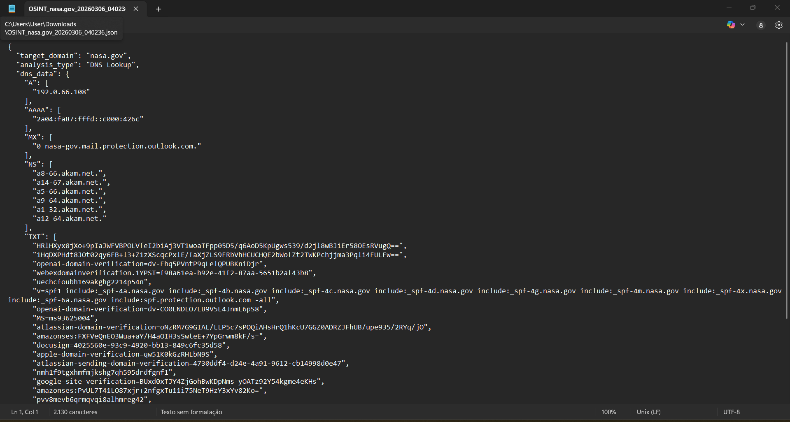
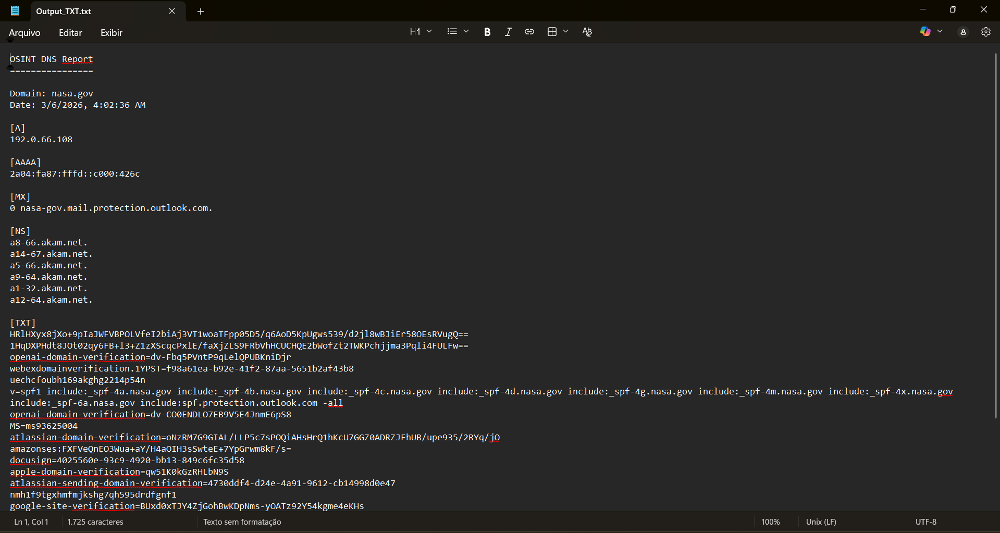

# OSINT Infrastructure Automation

Automation workflow built with n8n for domain infrastructure analysis.

## Features

- DNS lookup
- Infrastructure analysis
- Automated reporting
- Markdown export

## Tech Stack

- n8n
- API integrations
- workflow automation

## Workflow

## Example Output

## How it works

1. user inputs domain
2. workflow queries DNS API
3. data processed
4. report generated
